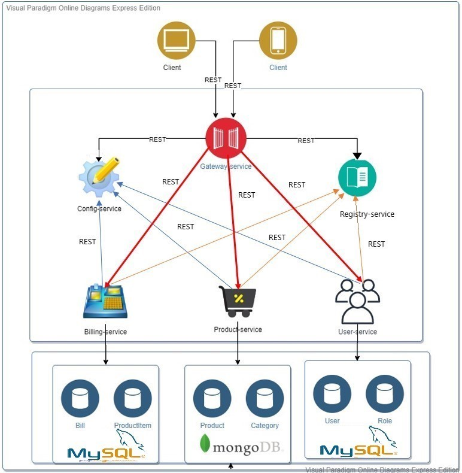

## 1. Project architecture
Our sample microservices-based system consists of the following modules:
- **gateway-service** - a module that Spring Cloud Gateway for running Spring Boot application that acts as a proxy/gateway in our architecture.
- **config-service** - a module that uses Spring Cloud Config Server for running configuration server. The configuration source git uri: https://github.com/waelamara/config-properties.git.
- **registry-service** - a module that depending on the example it uses Spring Cloud Netflix Eureka as an embedded discovery server.
- **user-service** - a module containing the first of our sample microservices (user management).
- **product-service** - a module containing the second of our sample microservices (product management). 
- **billing-service** - a module containing the third of our sample microservices (billing management). It communicates with both user-service and product-service.

The following picture illustrates the architecture described above.

